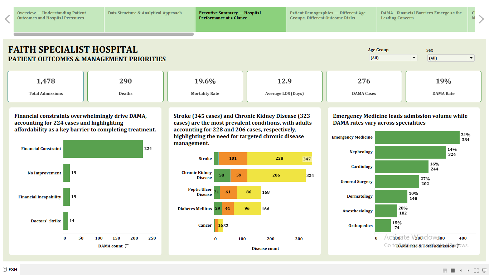
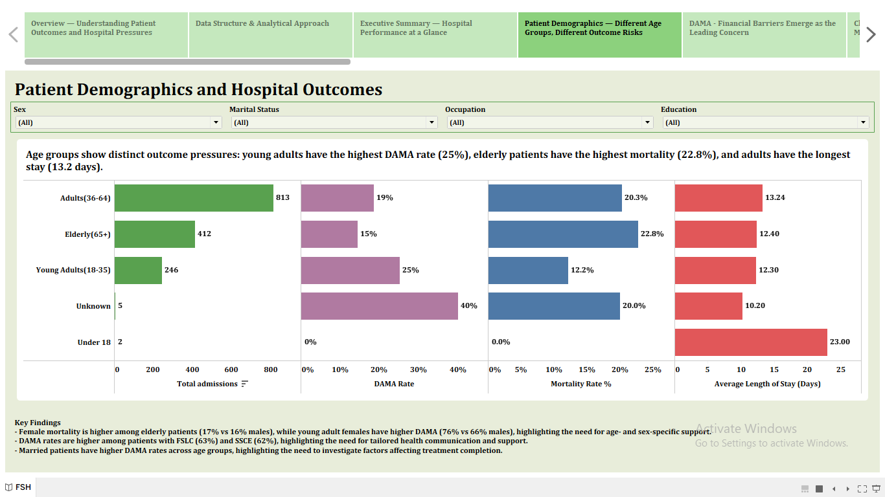
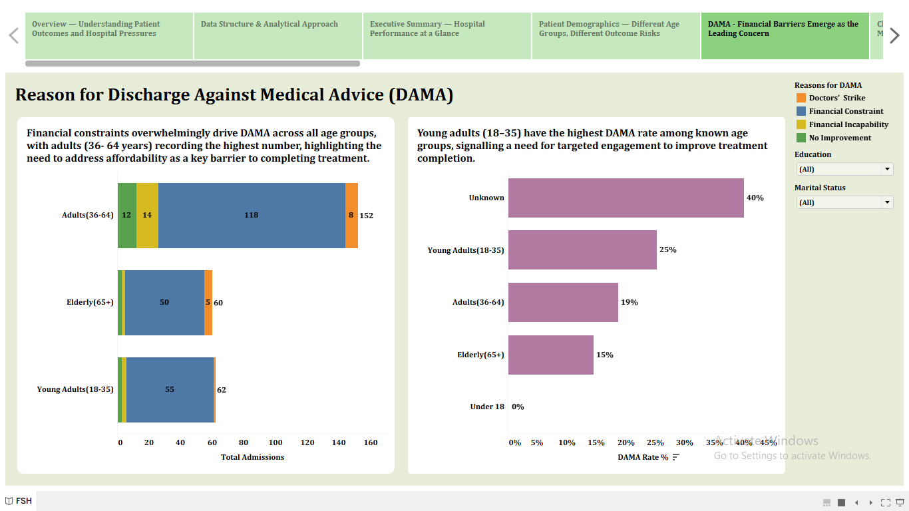
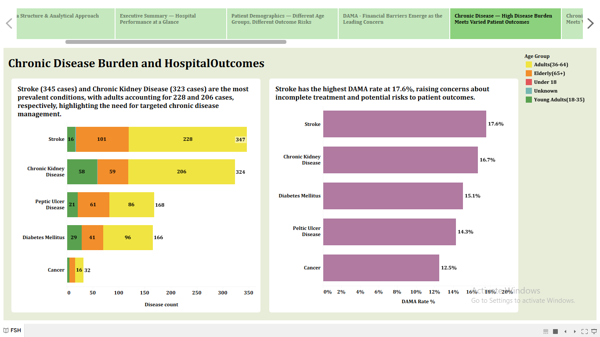
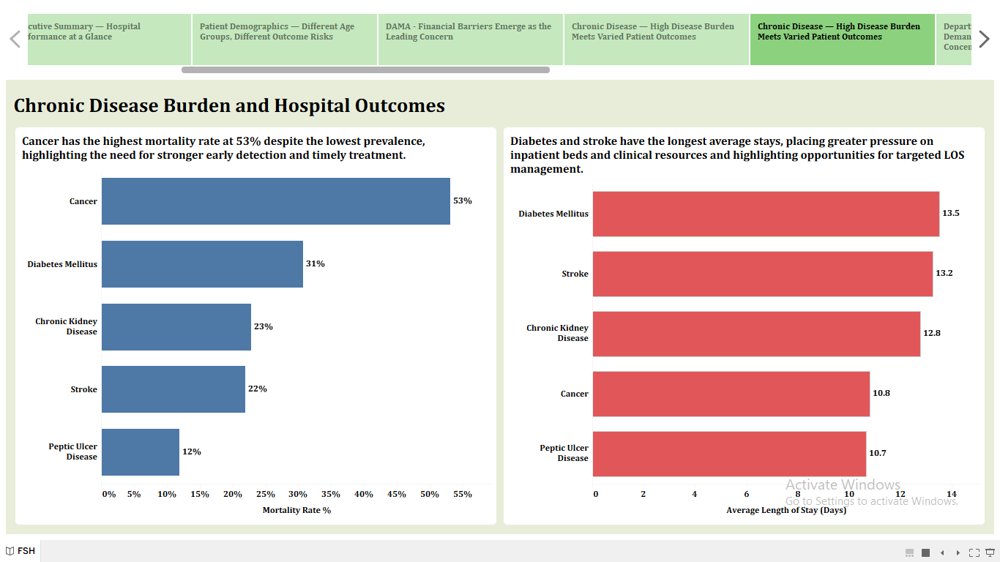
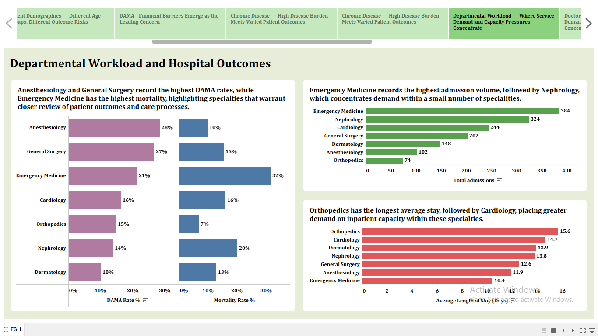
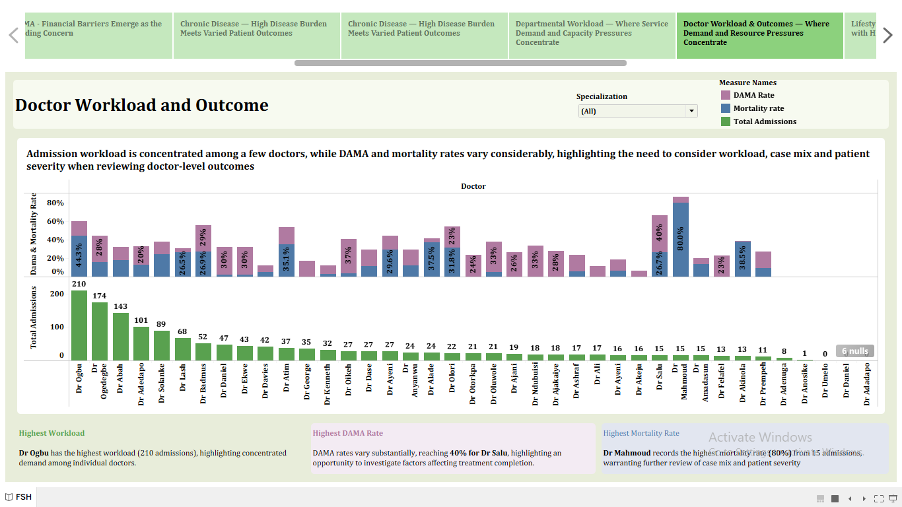
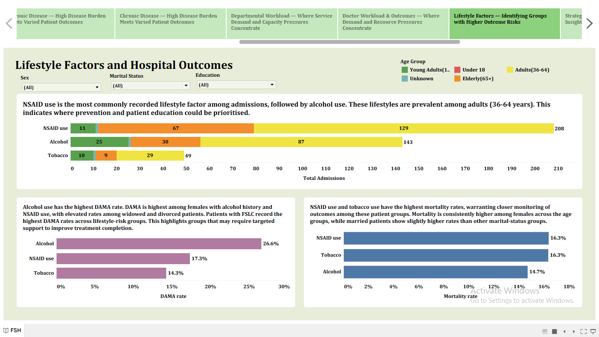

# Faith Specialist Hospital — Healthcare Data Analysis

## Project Overview

This healthcare analytics capstone project explores patient and hospital data from Faith Specialist Hospital. The project focuses on understanding patient outcomes, discharge against medical advice (DAMA), chronic disease burden, lifestyle factors and doctor workload.

SQL was used for data quality assessment, data cleaning and analysis, while Tableau was used to visualise the findings and develop interactive dashboards.

> **Note:** This project was completed as part of a healthcare data analytics training programme. The dataset was provided for the capstone project and is not included in this repository.
## Problem Statement

Faith Specialist Hospital has accumulated a large amount of patient data, including demographic information, admission records and health outcomes. However, the hospital faces challenges in using this data effectively.

Key concerns include patients being discharged against medical advice (DAMA), the burden of chronic diseases and mortality among certain patient groups. This project analyses the available data to identify patterns and provide insights that could support hospital management and patient care.

## Project Objectives

The analysis aimed to:

1. Analyse patient demographics in relation to hospital outcomes.
2. Identify common reasons for discharge against medical advice (DAMA).
3. Examine the prevalence and impact of chronic illnesses among patients.
4. Assess the impact of lifestyle factors on hospital outcomes.
5. Evaluate doctor workload across different specialisations.
6. Provide data-driven insights and recommendations that could support hospital management and patient care.
## Data Structure

The project used four relational tables:

- **Patient** — contains patient demographic and health information.
- **Admission** — contains hospital admission details and patient outcomes.
- **Doctor** — contains information about doctors and their specialisations.
- **Risk Factors** — contains recorded patient lifestyle and health risk factors.

The **Admission** and **Risk Factors** tables were connected to the **Patient** table using the patient ID, while the **Doctor** table was connected to the **Admission** table using the doctor ID. This structure allowed related information from the four tables to be analysed together.
## Tools Used

- **SQL (PostgreSQL/pgAdmin)** — used for data quality assessment, data cleaning and analysis.
- **Tableau** — used for data visualisation and dashboard development.
## Data Quality Assessment and Cleaning

Before the analysis, the data was assessed and cleaned to improve consistency and reliability.

The process included:

- Checking for missing values.
- Checking for duplicate records.
- Reviewing the data for inconsistencies.
- Standardising text values and formatting where necessary.
- Creating cleaned tables for analysis.
- Checking the cleaned data before proceeding with the analysis.
## Key KPIs

- **Total Admissions:** 1,478
- **Total Deaths:** 290
- **Mortality Rate:** 19.6%
- **Average Length of Stay:** 12.9 days
- **DAMA Cases:** 276
- **DAMA Rate:** 18.7%
## Key Findings

- **Financial constraints were the main recorded reason for DAMA**, accounting for 224 of the 276 DAMA cases.
- **Stroke was the most prevalent chronic condition** in the dataset, followed by chronic kidney disease (CKD).
- **Cancer had the highest mortality rate among the chronic conditions analysed**, despite having the lowest prevalence.
- Among the recorded lifestyle factors, **patients with a history of alcohol use had the highest DAMA rate**.
- **Emergency Medicine had the highest admission workload by specialty**, with 384 admissions shared between two doctors.
- Doctor workload varied considerably across specialties, suggesting an uneven distribution of admissions.
## Tableau Dashboards

### Executive Summary

### Patient Demographics

### Discharge Against Medical Advice (DAMA)

### Chronic Disease

### Doctor Workload

### Lifestyle Factors

## Recommendations

Based on the findings from the analysis:

1. **Target interventions according to age-group needs.** Older patients may benefit from closer monitoring, while the higher DAMA rate among young adults should be investigated further. Longer stays among adult patients should also be reviewed to identify opportunities to improve patient flow and discharge planning.

2. **Make financial barriers a priority area for intervention.** Management should investigate the financial pressures associated with DAMA and consider financial counselling, clearer communication of treatment costs and available payment-support options.

3. **Prioritise chronic disease management.** High-volume conditions such as stroke and CKD may require targeted management, while the high mortality observed among cancer patients warrants further investigation. Longer stays among diabetes and stroke patients should also be reviewed.

4. **Provide targeted education and support for patients with recorded lifestyle risk factors.** The higher DAMA rate among patients with recorded alcohol use warrants further investigation, while patients with tobacco and NSAID use may benefit from appropriate health education and monitoring.

5. **Review workload distribution and specialty-level resource allocation.** High admission volumes in Emergency Medicine and Nephrology should be considered in capacity planning. Specialty-level DAMA, mortality and length-of-stay patterns should also be investigated further.
## Assumptions and Limitations

- The analysis identifies patterns and associations within the available hospital data and does not establish causation.
- Higher mortality observed among patients with particular lifestyle factors does not mean that the lifestyle factor caused the outcome.
- DAMA reasons are based on the information recorded in the dataset and may not capture all underlying patient circumstances.
- Missing or unknown values within some demographic categories may limit interpretation.
- Differences in doctor workload and specialty outcomes may reflect patient volume, case complexity and severity rather than individual doctor performance.
- The findings should therefore be used to highlight areas for further investigation rather than as evidence of direct causation or individual clinical performance.

## Conclusion

The analysis identified several areas that may require management attention. Financial barriers were the main recorded reason for DAMA, while stroke and CKD accounted for a large proportion of the chronic disease burden. Patient outcomes also varied across age groups, lifestyle-factor groups and medical specialties.

Overall, the findings highlight opportunities for further investigation into financial support, chronic disease management, patient engagement, workload distribution and inpatient capacity. The analysis demonstrates how healthcare data can be used to identify patterns and support evidence-based decision-making.
